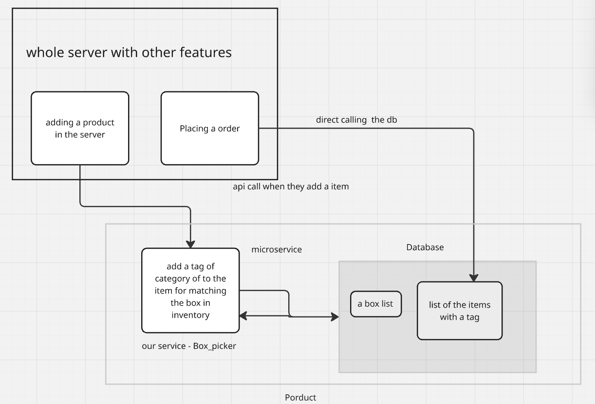

# Box Picker API

A small Django-based ecommerce box recommendation system that assigns a category to each product and selects the lowest-cost compatible shipping box based on size, weight, and category rules.

## Features

- Product creation with optional manual category override
- Automatic category assignment when no category is provided
- Gemini-based AI classification with safe fallback to STANDARD
- Deterministic box recommendation engine
- REST API endpoints for products, boxes, and box matching

## Tech Stack

- Python
- Django
- Django REST Framework
- SQLite (default)

## Project Structure

- `box_picker_project/` — Django project settings and URLs
- `core/` — models, serializers, views, services, tests
- `manage.py` — Django entry point

## Setup

### Windows

```powershell
cd C:\Users\suhri\Documents\coding\box_picker
python -m venv venv
.\venv\Scripts\Activate.ps1
python -m pip install django djangorestframework
$env:DJANGO_SETTINGS_MODULE='box_picker_project.settings'
python manage.py migrate
python manage.py runserver
```

### Linux / macOS

```bash
cd /path/to/box_picker
python3 -m venv venv
source venv/bin/activate
python -m pip install django djangorestframework
export DJANGO_SETTINGS_MODULE=box_picker_project.settings
python manage.py migrate
python manage.py runserver
```

## Environment Variables

For Gemini auto-classification, set this before starting Django:

### Windows

```powershell
$env:GEMINI_API_KEY="your_api_key_here"
```

### Linux / macOS

```bash
export GEMINI_API_KEY="your_api_key_here"
```

If the Gemini request fails or the key is missing, the app falls back to the `STANDARD` category automatically.

## API Endpoints

### Create a product

#### Windows PowerShell

```powershell
$response = Invoke-RestMethod -Uri "http://localhost:8000/api/v1/products/" `
  -Method Post `
  -ContentType "application/json" `
  -Body '{"title":"Perfume Glass Bottle","description":"Fragile glass container for liquid","length":6,"width":6,"height":14,"weight":0.35}'

$response | Format-List
```

Example response:

```powershell
id          : 15
title       : Perfume Glass Bottle
description : Fragile glass container for liquid
length      : 6.0
width       : 6.0
height      : 14.0
weight      : 0.35
category    : FRAGILE
```

#### Linux / macOS

```bash
curl -X POST http://localhost:8000/api/v1/products/ \
  -H "Content-Type: application/json" \
  -d '{"title":"Perfume Glass Bottle","description":"Fragile glass container for liquid","length":6,"width":6,"height":14,"weight":0.35}'
```

---

### Manually set a category

#### Windows PowerShell

```powershell
$response = Invoke-RestMethod -Uri "http://localhost:8000/api/v1/products/15/" `
  -Method Patch `
  -ContentType "application/json" `
  -Body '{"category":"FRAGILE"}'

$response | Format-List
```

#### Linux / macOS

```bash
curl -X PATCH http://localhost:8000/api/v1/products/15/ \
  -H "Content-Type: application/json" \
  -d '{"category":"FRAGILE"}'
```

---

### Create a box

#### Windows PowerShell

```powershell
Invoke-RestMethod -Uri "http://localhost:8000/api/v1/boxes/" `
  -Method Post `
  -ContentType "application/json" `
  -Body '{"name":"Standard Small","length":20,"width":15,"height":10,"max_weight":5,"cost":"15.00","allowed_categories":["STANDARD","APPAREL"]}'
```

#### Linux / macOS

```bash
curl -X POST http://localhost:8000/api/v1/boxes/ \
  -H "Content-Type: application/json" \
  -d '{"name":"Standard Small","length":20,"width":15,"height":10,"max_weight":5,"cost":"15.00","allowed_categories":["STANDARD","APPAREL"]}'
```

---

### Get box recommendation

#### Windows PowerShell

```powershell
Invoke-RestMethod -Uri "http://localhost:8000/api/v1/recommend-box/" `
  -Method Post `
  -ContentType "application/json" `
  -Body '{"items":[{"title":"Denim Jeans","length":14,"width":12,"height":3,"weight":0.8,"category":"APPAREL","quantity":1}]}'
```

Example response:

```powershell
box_id              : 1
box_name            : Standard Small
length              : 20.0
width               : 15.0
height              : 10.0
max_weight          : 5.0
cost                : 15.0
allowed_categories  : {STANDARD, APPAREL}
total_weight        : 0.8
required_dimensions : @{length=14.0; width=12.0; height=3.0}
```

#### Linux / macOS

```bash
curl -X POST http://localhost:8000/api/v1/recommend-box/ \
  -H "Content-Type: application/json" \
  -d '{"items":[{"title":"Denim Jeans","length":14,"width":12,"height":3,"weight":0.8,"category":"APPAREL","quantity":1}]}'
```

---

## Category Options

Valid categories are:

- `STANDARD`
- `FRAGILE`
- `APPAREL`
- `HEAVY_DUTY`
- `LIQUID`

## How recommendation works

The recommendation engine:

1. sums the total order weight
2. checks `box.max_weight`
3. checks whether the product dimensions fit inside the box
4. verifies the box allows all item categories
5. selects the lowest-cost compatible box

## Notes

- If a product is created without a category, the app attempts AI classification.
- If the AI call fails or no API key is available, it falls back to `STANDARD`.
- The box recommendation endpoint is deterministic and does not use AI for final box selection.

## Run tests

```bash
python manage.py test core --verbosity 2
```

## Troubleshooting

### No compatible box found

This usually means:

- no box matches the category combination
- the box is too small for the product dimensions
- the total weight exceeds the box capacity

### Gemini API fallback to STANDARD

This means:

- `GEMINI_API_KEY` is missing
- the API request timed out
- the API request failed
- the response was invalid

## License

This project is for demo and learning purposes.

## What I learnt from this project

1. structured way of building
2. reporting/ documenting since I generally skip most part and keep it a simple readme only
3. rest I have already worked on these tech so more understanding on them


